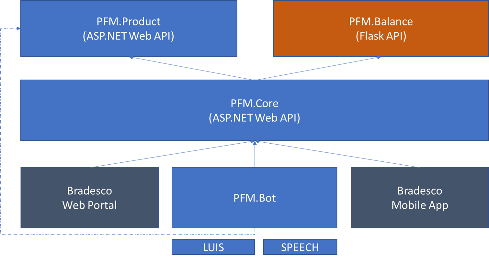

# Bradesco PFM

## Overview
Expanded vision of your project.

### Documentation
1. [Overview (this file)](./README.md)
2. [Adding Commands](./docs/AddingCommands.md)
3. [Basic Conversation](./docs/BasicConversation.md)

## Architecture



## Prerequisites
List of prerequisites in order to build or run the project:

| Requirement                       	| Description |
|-----------------------------------	|-----------------------------------------------------------------------------------------------------------------------------------------------------------------------------------------------------------------------------------------------------------------------	|
|[Visual Studio](https://www.visualstudio.com/downloads/)                         | Used for developing and testing                                                        |
|[Python Flask](http://flask.pocoo.org/)                         | Framework for Web development in Python                                                           |
|[Azure Subscription](https://azure.microsoft.com/en-us/)                         | Deploy of services/apis                                                           |
|[LUIS Key](https://www.luis.ai/)                         | Natural Language Processing API                                                         |
|[Bing Speech API Key](https://azure.microsoft.com/en-us/services/cognitive-services/speech/)                         | STT and TTS API                                                           |

## Quick Start
### Configuring the bot

Add a file `Web.config.secrets` on directory */src/PFM/PFM.Bot/*, right after `Web.config`, with the following Bot Framework, LUIS and other services endpoint:

```xml
<appSettings>
    <add key="BotId" value="<bot_id>" />
    <add key="MicrosoftAppId" value="<bot_microsoft_app_id>" />
    <add key="MicrosoftAppPassword" value="<bot_microsoft_app_password>" />
    <add key="LuisModelId" value="<luis_model_id>"/>
    <add key="LuisSubscriptionKey" value="<luis_subscription_key>"/>
    <add key="CoreEndpoint" value="<core_endpoint>"/>
    <add key="ProductsEndpoint" value="<products_endpoint>"/>
</appSettings>
```
By default, the endpoints for local tests are:
```xml
<add key="CoreEndpoint" value="http://localhost:52362"/>
<add key="ProductsEndpoint" value="http://localhost:59414"/>
```

### Enabling Web Chat

Add the file `chat.secrets.js` on directory */src/PFM/PFM.Bot/Chat* with the following schema and keys:

```js
var secrets = {
    direct_line_secret: '<directline>',
    YOUR_COGNITIVE_SPEECH_API_KEY: '<cognitive>'  
};
```
Once configured DirectLine channel, it's possible to access the page `http://<appurl>/Chat/index.html`.

### Chat with the bot

A typical conversation could be:
* Oi
* Tchau
* Posso jantar no fasano hoje?
* Eu posso jantar no habis?
* Posso jantar no habibolá?
* Como foi minha semana passada?
* Posso comprar um iPhone/smartphone/celular?
* /commands=proactive 


## References
Additional links:
* [Flask - Quick Start](http://flask.pocoo.org/docs/0.12/quickstart/)  