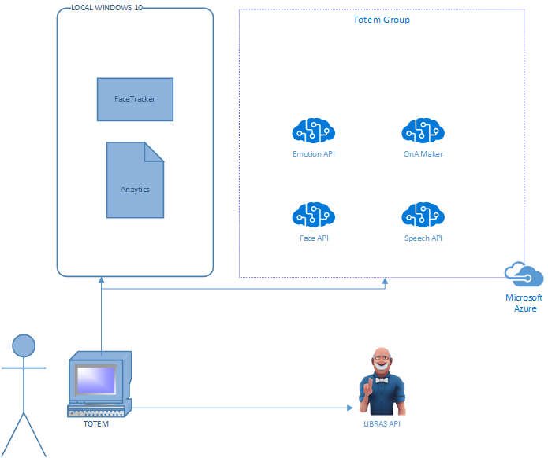
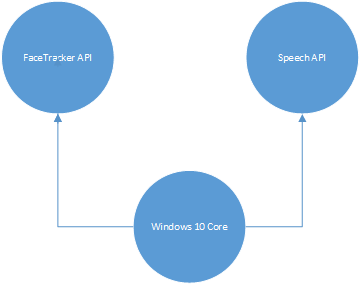
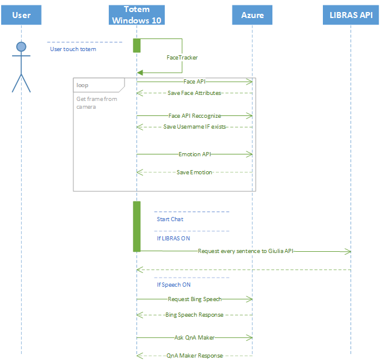

# Inteligent Totem
Solution to help bank user in their agencies to get help and go faster thru the processes.

## Overview
UWP App created to improve, speed up and organize the distribution of bank customers in the agency through artificial intelligence and cognitive services.

> **Use Case**: A client enters the agency and can go directly to the totem. Through the FACE API, the machine recognizes the user - in case there is a special need, the totem can serve it via voice, text or "Lbras" (Brazilian Language of Signals - for the deaf and dumb) - and initiates service, generating at the end a 2D bar code that can be read by ATMs and humans boxes, to speed up the service process.

> **Developer quote**: A very interesting case that this project brought us during its execution was the importance of the data. During the process we identified that, once we collect user data such as age, gender, requested transaction (payment, deposit, account opening, etc.) the bank would have the possibility to better identify the types of assistance per agency, per person and better distribute the focus of their care.
Another interesting advantage is the use of the bar code to better distribute customers within the agency, making people who do not need to enter the agency to be served at ATMs, speeding up service and being more objective.

### Architecture
This is a simple image to draw the architecture used in this project
- 

We're using two core API from windows 10 that will help us to use this app even in a Raspberry PI.
- 

And how this app works
- 

## Projects

### TotemInteligente

Used to interact with the cilent in the bank. The main goal is use some Cognitive services to provide more intelligence to spread the clients inside the agency. 

## Prerequisites
List of prerequisites in order to build or run the project:

| Requirement                       	| Description |
|-----------------------------------	|-----------------------------------------------------------------------------------------------------------------------------------------------------------------------------------------------------------------------------------------------------------------------	|
|[Windows 10 SDK](https://developer.microsoft.com/pt-br/windows/downloads/windows-10-sdk)                         | The Windows 10 SDK (10.0.15063.468) provides the latest headers, libraries, metadata, and tools for building Windows 10 apps |

## Usage (or Quick Start)

## References
Additional links:
* [Windows 10 Development](https://developer.microsoft.com/pt-br/windows/downloads/windows-10-sdk)
* [Bing Speech](https://azure.microsoft.com/pt-br/services/cognitive-services/speech/)
* [Face API](https://azure.microsoft.com/pt-br/services/cognitive-services/face/)
* [Emotion API](https://azure.microsoft.com/pt-br/services/cognitive-services/emotion/)
* [QnA Maker](https://qnamaker.ai/)
* [Translator API](https://azure.microsoft.com/pt-br/services/cognitive-services/translator-speech-api/)

